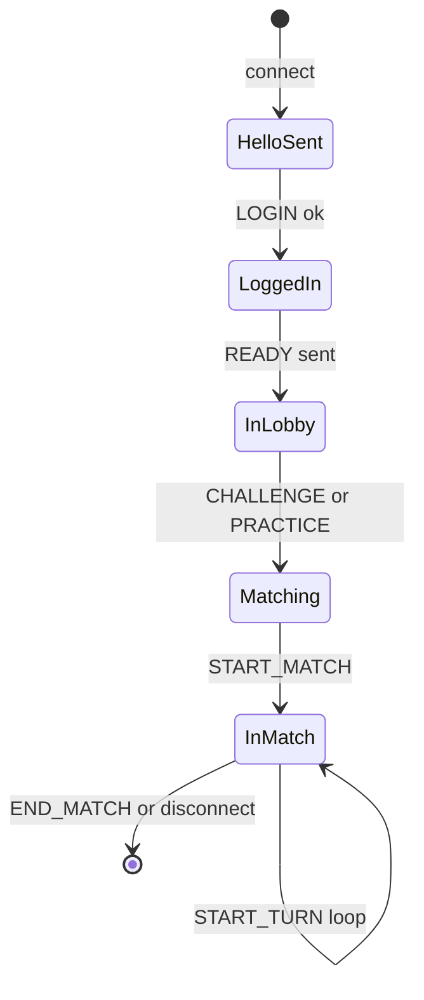

# Bit Defenders — game protocol (client implementer guide)

This document describes the WebSocket JSON protocol, connection lifecycle, and game rules for **Bit Defenders**, a simultaneous turn-based 1v1 sniper game.

## Transport and message shape

- Each WebSocket message is a UTF-8 JSON object with exactly two fields:
  - `command` (string): command name in `SCREAMING_SNAKE_CASE`.
  - `args` (object): command-specific payload; use `{}` when no fields are required.
- Numbers are JSON numbers; coordinates are integers on a square grid.
- **Protocol version** is `1` everywhere `version` appears.

## Connection finite state machine

After a TCP/WebSocket connection opens, the server drives the following sequence:

1. **Server → `HELLO` — client must not send game commands before this.
2. **Client → `LOGIN`
3. **Server → `READY`
4. **Client → `CHALLENGE` or `**PRACTICE**`
5. Matchmaking or practice setup, then `**START_MATCH**`, repeated `**START_TURN**` until `**END_MATCH**`.

If the client sends a command that is invalid for the current phase, the server responds with `**ERROR**` and keeps or closes the connection depending on severity.

## Commands reference

### `HELLO` (server → client)

| Field     | Type | Description |
| --------- | ---- | ----------- |
| `version` | int  | Always `1`. |

### `LOGIN` (client → server)

| Field     | Type   | Description                          |
| --------- | ------ | ------------------------------------ |
| `name`    | string | Display name; must be unique online. |
| `version` | int    | Must equal server `HELLO.version`.   |

On success: server sends `READY`. On mismatch: `ERROR` and connection closed.

### `READY` (server → client)

Empty object `{}`. Client must then send `CHALLENGE` or `PRACTICE`.

### `CHALLENGE` (client → server)

| Field    | Type   | Description                                                                       |
| -------- | ------ | --------------------------------------------------------------------------------- |
| `name`   | string | Optional. If set, only match players consistent with the matchmaking rules below. |
| `seed`   | uint32 | Optional map seed. If both matched players provide seeds, they must match.        |
| `ranked` | bool   | Optional. If set to true, the match will affect Elo score.                        |

### `PRACTICE` (client → server)

Starts a match immediately against a server-controlled bot.

| Field   | Type   | Description                                                                 |
| ------- | ------ | ----------------------------------------------------------------------------- |
| `seed`  | uint32 | Optional map seed; if omitted, server generates a random 32-bit seed.        |
| `my_id` | int    | Optional. `0` (default) or `1` — which player slot you take vs the practice bot (spawn side). |

### `START_MATCH` (server → client)

| Field            | Type       | Description                                                                  |
| ---------------- | ---------- | ---------------------------------------------------------------------------- |
| `match_id`       | string     | UUID for persistence / replay                                                |
| `your_player_id` | int        | `0` or `1` — which `Player.id` you are.                                      |
| `config`         | GameConfig | Map size, limits, players (including hero spawns), `seed`, and `hero_types`. |
| `state`          | GameState  | **Full** map: every wall, hero, and projectile (same payload for both players and spectators). No fog. |

### `START_TURN` (server → client)

| Field   | Type      | Description                                                                   |
| ------- | --------- | ----------------------------------------------------------------------------- |
| `turn`  | int       | 1-based turn index (first turn is `1`).                                       |
| `state` | GameState | **Fogged** snapshot: only entities relevant to your vision rules (see below). |

### `MOVE` (client → server, in match)

| Field      | Type   | Description                                                                                                                                    |
| ---------- | ------ | ---------------------------------------------------------------------------------------------------------------------------------------------- |
| `hero_id`  | int    | Which hero you control.                                                                                                                        |
| `x`,`y`    | int    | Target cell for movement intent (see movement rules).                                                                                          |
| `comment`  | string | **Optional.** Short player/shout text persisted with replay and shown in UI. See **Order comments** below. |

Exactly **one** `MOVE` **or** `SHOOT` per hero you own per turn. Sending two actions for the same hero is an error.

### `SHOOT` (client → server, in match)

| Field      | Type   | Description                                                                        |
| ---------- | ------ | ---------------------------------------------------------------------------------- |
| `hero_id`  | int    | Shooter.                                                                           |
| `x`,`y`    | int    | Aim point; defines trajectory via Bresenham line from hero center.                 |
| `comment`  | string | **Optional.** Same as `MOVE`; see **Order comments** below.                              |

### `END_MATCH` (server → client)

| Field    | Type   | Description                                              |
| -------- | ------ | -------------------------------------------------------- |
| `reason` | string | `disconnect`, `win`, `tie`, `timeout`.                   |
| `winner` | string | Present when `reason` is `win`: winning player's `name`. |

### `ERROR` (server → client)

| Field     | Type   | Description                                   |
| --------- | ------ | --------------------------------------------- |
| `code`    | string | Stable machine-readable code.                 |
| `message` | string | Human-readable text.                          |
| `fatal`   | bool   | If true, connection may be closed after this. |

### Order comments (`comment` on `MOVE` / `SHOOT`)

- **`args.comment`** is optional on both `MOVE` and `SHOOT`. It does **not** affect simulation and is purely cosmetical or for debugging
- Can be a Unicode string of up to **36 characters**. If shorther than **16 character**, it is shown as a speech bubble in the replay viewer. Optionally, a newline `\n` character can be used to control the bubble cutoff (so you can have a 15-character bubble followed by a 20 character message shown in the sidebar)

---

## Game rules (high level)

- **Bit Defenders** is a 1v1 match: two players; each controls **two** sniper **heroes** on a **rectangular** grid (`GameConfig.width` × `GameConfig.height`, default **51×90**).
- Turns are **simultaneous**: both players submit orders for all their heroes; the server resolves one combined tick.
- Heroes have **HP** (starting value from `config.hero_types["sniper"].max_hp`). Projectiles deal `config.hero_types["sniper"].projectile_damage`. **No friendly fire.**
- **Walls** are 3×3 blocks (by center tile), **block** movement and projectiles.
- **Reload**: after shooting, `cooldown` is set so the hero cannot shoot again until it reaches `0` (see detailed timeline). With default sniper tuning, `shoot_cooldown` and `projectile_ttl` line up so a hero typically cannot fire again while its prior shot is still in flight.
- **Vision** is a square (Chebyshev distance) around each friendly hero **center**. **Fog of war** hides enemy heroes when **no tile** of their **3×3 footprint** intersects that vision union.
- Match ends when a player has **no heroes left**, or after **`turns`** simulated ticks, or on disconnect.  
On timeout, winner tie-break is: more alive heroes, then higher total alive HP, then larger in-bounds vision coverage; if still tied, result is a tie.

## Game rules (detailed)

### Coordinates and 3×3 entities

- Tile coordinates are **0-based**: `x` in `[0, width-1]`, `y` in `[0, height-1]`.
- **Hero** and **wall** centers sit on the subgrid where `x % 3 == 1` and `y % 3 == 1` (aligned 3×3 blocks).
- A **hero** or **wall** with center `(cx, cy)` **occupies** all nine tiles `(cx+dx, cy+dy)` for `dx, dy ∈ {-1,0,1}`.
- **Projectile** position is a **single** tile `(x, y)`.

### Movement (`MOVE`)

- Each hero may move **at most one step** per turn in one of **8** directions (including diagonals). Let `(cx, cy)` be the hero center before movement and `(tx, ty)` the target from the command. If `(tx, ty)` lies inside the hero's current **3×3 footprint**, the move is a **no-op**. Otherwise compute `sx = sign(tx - cx)` and `sy = sign(ty - cy)` where each `sign` is `-1`, `0`, or `+1` (not both zero).
- The new center is `(cx + 3·sx, cy + 3·sy)` so the hero stays on valid centers (`x % 3 == 1`, `y % 3 == 1`). This is one step on the **coarse grid** of 3×3 blocks (cardinal or diagonal), not a single 1-tile shift of the center coordinates.
- If that destination center would be **out of map** or overlap any **wall** 3×3 hitbox, the move is a **no-op**.
- Heroes **do not** collide with each other (overlap allowed).

### Shooting (`SHOOT`)

- Requires `cooldown == 0`.
- Trajectory is the **integer Bresenham line** from the hero's center **after movement** this turn to the aim `(x, y)` (inclusive of endpoints in the line raster).
- **Origin** of the shot is that center (stored for reference). The projectile is left at the hero center and then advances in normal projectile resolution in the same turn.
- **Speed** per turn is `config.hero_types["sniper"].projectile_speed`. On the firing turn and on each later turn, the projectile advances up to that many Bresenham steps.
- `ttl` starts at `config.hero_types["sniper"].projectile_ttl`. At the **end** of each turn after projectile resolution, `ttl` decreases by `1`. The projectile is removed after `ttl` would go below `0` (so `0` is still a fully simulated last turn).
- **Hits** along each travel segment (firing turn segment and each later segment):
  - **Walls** and **map edge** consume the projectile with no damage.
  - The **first** enemy hero whose **3×3 hitbox** intersects the segment (in travel order) takes `projectile_damage` HP; projectile consumed.
  - Reaching the **aim tile** (last point on the Bresenham path) with no such hit also removes the projectile (no damage).
  - **Friendly** heroes and **other projectiles** do not stop shots.
- **Tie-breaking** if multiple hero hits at the same distance: lowest `hero_id`, then lowest `owner_id`.

### Cooldown timeline

- When a hero successfully fires, at end of that turn its `cooldown` is set to `config.hero_types["sniper"].shoot_cooldown` (default **4**).
- At end of each turn, every hero's `cooldown` is decreased by **1** if `cooldown > 0`, **except** heroes that fired this turn are set to the configured `shoot_cooldown` after decrement logic.

### Vision and fog (`START_TURN`)

Fog applies to **`START_TURN`** (and later turns only). **`START_MATCH`** always sends the complete world state so clients can render the full map once before play.

- **Vision cells**: union of all tiles with Chebyshev distance ≤ `vision_range` (default **20**) from **each** friendly hero **center**.
- **Walls** and **Enemy heroes**: visible iff **any tile** of their **3×3 footprint** lies in the vision union
- **Projectiles**: enemy projectiles are included if their **tile** lies in the vision union.
- Your own heroes are always fully included.

### Matchmaking (`CHALLENGE`)

- **Open challenge** (no `name`): joins a pool; matches any other open challenger, or a named challenger who named you
- **Named challenge** (`name: "Bob"`): matches only if Bob has challenged in a compatible way: Bob named you, or Bob is open and you named Bob
- **Seed compatibility**: if both players supplied `seed` in `CHALLENGE`, they are only pairable when the two seeds are equal. If one side omits `seed`, the provided seed is used.
- **Ranked**: in addition to the above, the value of the `ranked` field must match for both challengers

(Exact pairing is implemented server-side; ties resolved by FIFO.)

### Disconnect

If a player disconnects during a match, the opponent wins with `reason: "disconnect"`.

### Missing or invalid orders

If a player sends no valid pair of actions for their heroes by deadline logic, missing heroes **no-op** for that turn; the server still simulates and may send `ERROR` for the bad parts.

---

## `GameConfig` / `GameState` shapes

See Rust `protocol/protocol.rs` for field-for-field types. Summary:

- **GameConfig**: `width`, `height`, `turns`, `vision_range`, `seed`, `players`, `hero_types`.
  - `seed`: unsigned 32-bit map seed (`0..2^32-1`).
  - **Player**: `id`, `name`, `heroes`.
  - **Player.heroes[]**: `id`, `x`, `y`, `type`.
  - `hero_types.sniper`: `shoot_cooldown`, `projectile_ttl`, `projectile_speed`, `max_hp`, `projectile_damage`.
- **GameState**: `heroes`, `projectiles`, `walls`.
- **Hero**: `id`, `owner_id`, `type` (`"sniper"`), `x`, `y`, `hp`, `cooldown`.
- **Projectile**: `owner_id`, `type` (`"sniper"`), `origin_x`, `origin_y`, `x`, `y`, `ttl`.
- **Wall**: `x`, `y` (center on the valid hero grid).

